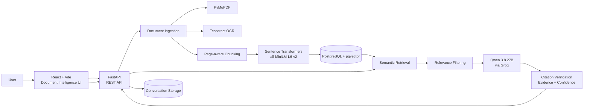

# ASTRA INTEL

### AI-Powered Defence Document Intelligence System

ASTRA INTEL is a document intelligence platform for analysing technical and defence documents. Users can upload PDFs, including scanned PDFs, ask grounded questions, generate summaries, compare documents, and inspect the evidence supporting an answer.

The system combines OCR, semantic search, Retrieval-Augmented Generation (RAG), dynamic query decomposition, Cross-Encoder reranking, and evidence verification to produce traceable document-grounded responses.

---

## What ASTRA Does

- PDF ingestion and page-aware text extraction
- OCR fallback for scanned PDFs
- Page-aware sentence-based chunking
- Semantic search using vector embeddings
- Dynamic query decomposition for complex questions
- Retrieval-Augmented Generation (RAG)
- Cosine-distance relevance filtering
- Cross-Encoder reranking
- Grounded question answering
- Evidence and citation verification
- Confidence and evidence coverage scoring
- Abstention when requested information is not supported
- Page-level source references
- Document summarization
- Multi-document comparison
- Multi-turn conversations
- Conversation persistence
- Evidence-ready responses for a **View Evidence** workflow

---

## Architecture



---

## RAG Pipeline

The question-answering pipeline uses multiple retrieval stages before generating an answer.

```text
User Question
      ↓
Dynamic Query Decomposition
      ↓
Vector Embedding
      ↓
PostgreSQL + pgvector
      ↓
Cosine-Distance Filtering
      ↓
Candidate Chunks
      ↓
Cross-Encoder Reranking
      ↓
Top Relevant Chunks
      ↓
Qwen 3.8 27B via Groq
      ↓
Evidence Verification
      ↓
Grounded Answer / Abstention
```

### Retrieval Process

For a simple question, ASTRA can use the original question as the retrieval query.

For complex questions, the system dynamically generates independent retrieval queries.

For example:

```text
Compare X-2, TerraMax, and Talon
```

can be decomposed into retrieval queries covering the individual entities and requested comparison aspects.

This avoids relying on hardcoded document-specific entities.

### Vector Retrieval

ASTRA uses:

```text
sentence-transformers/all-MiniLM-L6-v2
```

to create embeddings for document chunks and user queries.

Candidate chunks are retrieved using PostgreSQL + pgvector cosine distance.

The current retrieval stage:

```text
Up to 20 candidates per retrieval query
        ↓
Cosine-distance threshold
        ↓
Candidate deduplication
```

### Cross-Encoder Reranking

Retrieved candidates are reranked using:

```text
cross-encoder/ms-marco-MiniLM-L-6-v2
```

The Cross-Encoder evaluates the relationship between the user's question and each candidate passage.

The highest-ranked chunks are then passed to the language model as evidence.

This provides an additional relevance-selection stage after vector similarity search.

---

## Grounded Question Answering

ASTRA generates answers using the retrieved document evidence.

The answer-generation system is instructed to:

- Use only information supported by the document context
- Avoid inventing facts
- Address every requested entity in multi-entity questions
- Address every requested aspect in comparisons
- Avoid claiming information is absent simply because it was not retrieved
- Include only details relevant to the question
- Provide page references
- Remain concise but complete

For example, a comparison question involving multiple UGVs is expected to address every requested vehicle rather than answering only the easiest entity to retrieve.

---

## Evidence Verification

ASTRA does not stop after generating an answer.

For each question, the system:

1. Analyses the question.
2. Generates retrieval queries when necessary.
3. Retrieves candidate document chunks.
4. Filters candidates using semantic similarity.
5. Reranks candidates using a Cross-Encoder.
6. Generates an answer using the retrieved evidence.
7. Verifies the answer against the retrieved evidence.
8. Returns grounding and confidence information.
9. Exposes source passages and page numbers for evidence inspection.

The verification response can include:

```json
{
  "grounded": true,
  "confidence": 0.95,
  "supported_claims": [],
  "unsupported_claims": [],
  "evidence_coverage": 1.0
}
```

### Evidence Coverage

Evidence coverage represents the proportion of factual claims that are supported by the retrieved evidence.

### Abstention

If the requested information is not supported by the available evidence, ASTRA can abstain rather than inventing an answer.

Example:

```text
I couldn't find this information in the provided document.
```

A successful abstention is explicitly represented by the verification system:

```json
{
  "grounded": true,
  "abstained": true
}
```

This distinction prevents a correct "information not supported" response from being incorrectly treated as an unsupported generated claim.

---

## Features

| Feature | Status |
|---|---|
| PDF upload | ✅ |
| PyMuPDF extraction | ✅ |
| Scanned PDF OCR | ✅ |
| Page-aware chunking | ✅ |
| Sentence embeddings | ✅ |
| PostgreSQL + pgvector | ✅ |
| Dynamic query decomposition | ✅ |
| Semantic vector retrieval | ✅ |
| Cosine-distance filtering | ✅ |
| Cross-Encoder reranking | ✅ |
| RAG question answering | ✅ |
| Grounding verification | ✅ |
| Unsupported-query abstention | ✅ |
| Evidence confidence scoring | ✅ |
| Evidence coverage scoring | ✅ |
| Page-level sources | ✅ |
| Document summaries | ✅ |
| Multiple documents | ✅ |
| Document comparison | ✅ |
| Multi-turn conversations | ✅ |
| Conversation persistence | ✅ |
| View Evidence workflow support | ✅ |

---

## Technology Stack

| Layer | Technology |
|---|---|
| Frontend | React, Vite |
| Backend | FastAPI |
| Database | PostgreSQL |
| Vector Search | pgvector |
| ORM | SQLAlchemy |
| PDF Processing | PyMuPDF |
| OCR | Tesseract |
| Embeddings | sentence-transformers/all-MiniLM-L6-v2 |
| Reranking | Cross-Encoder / ms-marco-MiniLM-L-6-v2 |
| LLM | Qwen 3.8 27B via Groq |
| Validation | Pydantic |

---

## API

| Endpoint | Purpose |
|---|---|
| `POST /upload` | Upload and process a document |
| `POST /search` | Semantic document search |
| `POST /ask` | Ask a grounded question |
| `POST /documents/{document_id}/summary` | Generate a document summary |
| `POST /documents/compare` | Compare two documents |
| `GET /conversations` | List conversations |
| `GET /conversations/{conversation_id}` | Retrieve conversation history |

---

## Project Structure

```text
ASTRA-INTEL/
├── backend/
│   ├── app/
│   │   ├── models/
│   │   ├── services/
│   │   ├── database.py
│   │   └── main.py
│   ├── uploads/
│   ├── .env
│   └── requirements.txt
├── frontend/
└── README.md
```

---

## Local Setup

### Backend

```bash
git clone <your-repository-url>
cd <repository>/backend

python -m venv venv
```

### Windows

```bash
venv\Scripts\activate
```

### Install Dependencies

```bash
pip install -r requirements.txt
```

### Environment Variables

Create a `.env` file:

```env
DATABASE_URL=your_postgresql_connection_string
GROQ_API_KEY=your_groq_api_key
```

### PostgreSQL

Make sure the PostgreSQL `pgvector` extension is enabled:

```sql
CREATE EXTENSION IF NOT EXISTS vector;
```

### Run the API

```bash
uvicorn app.main:app --reload
```

FastAPI's generated Swagger documentation will be available through the running API.

---

## OCR

ASTRA uses Tesseract as a fallback when a PDF page contains little or no extractable text.

This allows the ingestion pipeline to process both:

- Digitally generated PDFs
- Scanned/image-based PDFs

Tesseract must be installed separately and its executable must be available to the application.

---

## Document Processing

The ingestion pipeline processes documents page by page.

```text
PDF
 ↓
PyMuPDF extraction
 ↓
OCR fallback when required
 ↓
Text cleaning
 ↓
Sentence-aware chunking
 ↓
Embedding generation
 ↓
PostgreSQL + pgvector
```

Each stored chunk retains information such as:

- Document ID
- Document name
- Page number
- Chunk content
- Vector embedding

This allows retrieved evidence to be traced back to its source page.

---

## Conversation System

ASTRA supports persistent conversations.

The `/ask` endpoint can use previous conversation messages as additional conversational context while still grounding the current answer in retrieved document evidence.

Conversation history can be accessed through:

```text
GET /conversations
```

and:

```text
GET /conversations/{conversation_id}
```

---

## Document Summarization

ASTRA can generate a summary for an uploaded document through:

```text
POST /documents/{document_id}/summary
```

The document's stored chunks are retrieved in page order and supplied to the language model.

---

## Document Comparison

ASTRA supports comparison between two uploaded documents.

```text
POST /documents/compare
```

The endpoint retrieves the chunks belonging to each selected document and sends the two document contexts to the comparison system.

The comparison can identify:

- Main topics
- Key points
- Similarities
- Differences

---

## Security

Secrets such as database credentials and API keys must be stored in environment variables and must never be committed to Git.

Recommended `.gitignore` entries:

```text
.env
venv/
__pycache__/
uploads/
```

If credentials have ever been exposed publicly, rotate them before making the repository public.

---

## Attribution & Credits

ASTRA INTEL uses third-party open-source software, models, and services. Their respective licenses and model terms remain applicable.

### Libraries and Infrastructure

- FastAPI
- SQLAlchemy
- PostgreSQL
- pgvector
- PyMuPDF
- Tesseract OCR
- Pydantic
- Sentence Transformers

### Models and Services

- `sentence-transformers/all-MiniLM-L6-v2` for text embeddings
- `cross-encoder/ms-marco-MiniLM-L-6-v2` for passage reranking
- Qwen 3.8 27B accessed through Groq for language generation

Check each project's repository or model card for the current license, attribution requirements, and usage terms before redistribution.

---

## AI-Assisted Development

ChatGPT was used as a technical assistance tool during development for research, model/framework discussions, debugging, implementation guidance, and explaining unfamiliar concepts.

The project author made the architecture and implementation decisions, integrated the components, tested the system, and is responsible for the final application.

---

## Responsible Use

ASTRA INTEL is a document-grounded information system.

Generated answers should be checked against the cited source material, especially when documents contain:

- Incomplete information
- Ambiguous statements
- Poor-quality scans
- OCR errors
- Conflicting information

ASTRA's verification system is designed to improve traceability and reduce unsupported responses, but evidence should still be reviewed when accuracy is critical.

---

## Current RAG Validation

The RAG pipeline has been tested against several important query types.

### Basic Retrieval

```text
What sensors can a UGV use to observe its environment
and determine its position?
```

### Multi-Fact Retrieval

```text
What is TerraMax and what are its demonstrated uses?
```

### Multi-Entity Comparison

```text
Compare the X-2, TerraMax, and Talon UGVs in terms
of their purpose and capabilities.
```

### Unsupported Information

```text
What programming language was used to develop the
THeMIS UGV control software?
```

The system correctly abstains when the requested information is not supported by the available document evidence.

### Multi-Hop Question

```text
How do the sensors of an autonomous UGV contribute
to its ability to navigate and avoid harming people,
property, or itself?
```

These tests cover retrieval, multi-entity queries, reranking, grounded generation, evidence verification, abstention, and multi-hop reasoning.

---

## License

Add the project's chosen license here before public release.

Third-party libraries, models, datasets, and services remain subject to their own licenses and terms.
