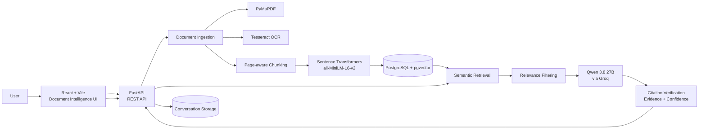

# ASTRA INTEL

### AI-Powered Defence Document Intelligence System

ASTRA INTEL is a document intelligence platform for analysing technical and defence documents. Users can upload PDFs, including scanned PDFs, ask grounded questions, generate summaries, compare documents, and inspect the evidence supporting an answer.

## What ASTRA Does

- PDF ingestion and page-aware text extraction
- OCR fallback for scanned PDFs
- Semantic search with vector embeddings
- Retrieval-Augmented Generation (RAG)
- Grounded question answering
- Citation verification and evidence scoring
- Page-level source references
- Document summarization
- Multi-document comparison
- Multi-turn conversations
- Conversation persistence
- Evidence-ready responses for a "View Evidence" workflow

## Architecture

The complete architecture is available in [`architecture.mmd`](./architecture.mmd).



## Core RAG Flow

```text
PDF
 ↓
PyMuPDF / OCR
 ↓
Page-aware chunks
 ↓
Embeddings
 ↓
PostgreSQL + pgvector
 ↓
Semantic retrieval
 ↓
Relevant evidence
 ↓
Qwen 3.8 27B via Groq
 ↓
Citation verification
 ↓
Grounded answer + evidence
```

## Key Trust Mechanism

ASTRA does not stop after generating an answer.

For every question, the system:

1. Retrieves relevant passages from the uploaded documents.
2. Generates an answer using only the retrieved context.
3. Verifies the generated answer against the evidence.
4. Produces grounding status, confidence, supported claims, unsupported claims, and source passages.
5. Exposes page and passage information for the frontend's **View Evidence** workflow.

This makes the system focused on traceable, document-grounded answers rather than unrestricted generation.

## Features

| Feature | Status |
|---|---|
| PDF upload | ✅ |
| PyMuPDF extraction | ✅ |
| Scanned PDF OCR | ✅ |
| Chunking | ✅ |
| Sentence embeddings | ✅ |
| PostgreSQL + pgvector | ✅ |
| Semantic search | ✅ |
| Relevance filtering | ✅ |
| RAG question answering | ✅ |
| Grounding / unsupported-answer detection | ✅ |
| Citation verification | ✅ |
| Evidence confidence scoring | ✅ |
| Page-level sources | ✅ |
| Document summaries | ✅ |
| Multiple documents | ✅ |
| Document comparison | ✅ |
| Multi-turn conversations | ✅ |
| Conversation persistence | ✅ |

## Technology Stack

| Layer | Technology |
|---|---|
| Frontend | React, Vite |
| Backend | FastAPI |
| Database | PostgreSQL |
| Vector Search | pgvector |
| ORM | SQLAlchemy |
| PDF Processing | PyMuPDF |
| OCR | Tesseract |
| Embeddings | Sentence Transformers |
| LLM | Qwen 3.8 27B via Groq |
| Validation | Pydantic |

## API

| Endpoint | Purpose |
|---|---|
| `POST /upload` | Upload and process a document |
| `POST /search` | Semantic document search |
| `POST /ask` | Ask a grounded question |
| `POST /documents/{document_id}/summary` | Generate a document summary |
| `POST /documents/compare` | Compare two documents |
| `GET /conversations` | List conversations |
| `GET /conversations/{conversation_id}` | Retrieve conversation history |

## Project Structure

```text
ASTRA-INTEL/
├── backend/
│   ├── app/
│   │   ├── models/
│   │   ├── services/
│   │   ├── database.py
│   │   └── main.py
│   ├── uploads/
│   ├── .env
│   └── requirements.txt
├── frontend/
└── README.md
```

## Local Setup

### Backend

```bash
git clone <your-repository-url>
cd <repository>/backend

python -m venv venv
```

Windows:

```bash
venv\Scripts\activate
```

Install dependencies:

```bash
pip install -r requirements.txt
```

Create `.env`:

```env
DATABASE_URL=your_postgresql_connection_string
GROQ_API_KEY=your_groq_api_key
```

Make sure PostgreSQL has the pgvector extension enabled:

```sql
CREATE EXTENSION IF NOT EXISTS vector;
```

Run the API:

```bash
uvicorn app.main:app --reload
```

API documentation is available through FastAPI's generated Swagger interface.

### OCR

ASTRA uses Tesseract as a fallback when a PDF page contains no extractable text. Install the Tesseract engine separately and ensure its executable is available to the application.

## Security

Secrets such as database credentials and API keys must be stored in environment variables and must never be committed to Git.

Recommended `.gitignore` entries:

```text
.env
venv/
__pycache__/
uploads/
```

If credentials have ever been exposed publicly, rotate them before making the repository public.

## Attribution & Credits

ASTRA INTEL uses third-party open-source software, models, and services. Their respective licenses and model terms remain applicable.

### Libraries and infrastructure

- FastAPI
- SQLAlchemy
- PostgreSQL
- pgvector
- PyMuPDF
- Tesseract OCR
- Pydantic
- Sentence Transformers

### Models and services

- `sentence-transformers/all-MiniLM-L6-v2` for text embeddings
- Qwen 3.8 27B accessed through Groq for language generation

Check each project's repository or model card for the current license, attribution requirements, and usage terms before redistribution.

### AI-assisted development

ChatGPT was used as a technical assistance tool during development for research, model/framework discussions, debugging, implementation guidance, and explaining unfamiliar concepts.

The project author made the architecture and implementation decisions, integrated the components, tested the system, and is responsible for the final application.

## Responsible Use

ASTRA INTEL is a document-grounded information system. Generated answers should be checked against the cited source material, especially when documents contain incomplete, ambiguous, or low-quality information.

## License

Add the project's chosen license here before public release. Third-party libraries, models, datasets, and services remain subject to their own licenses and terms.
